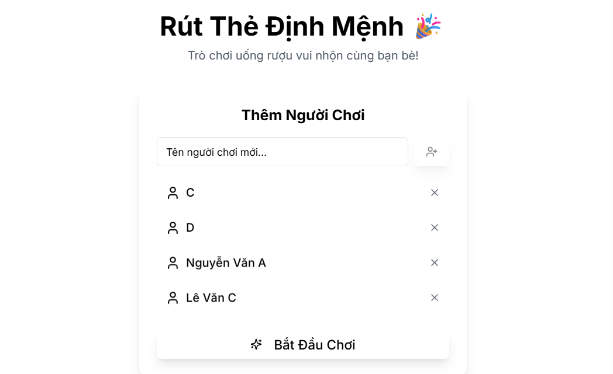

# 🍻 PartyBox

> Web app trò chơi nhóm, thiết kế dành riêng cho các buổi tiệc, uống rượu, và tụ họp bạn bè.

---

## 🎉 Mô tả

**PartyBox** là một ứng dụng chơi trực tiếp trên trình duyệt giúp nhóm bạn:
- Nhập tên từng người chơi
- Rút thẻ ngẫu nhiên có nội dung hài hước, bạo, skinship nhẹ, thử thách, câu hỏi...
- Lưu lịch sử người rút
- Giao diện sống động, dễ sử dụng trên điện thoại hoặc máy tính

---

## 🖼️ Screenshot

 <!-- Thêm hình vào thư mục public nếu có -->

---

## 🚀 Demo

Sẽ cập nhật sau khi deploy.

---

## 🧩 Tính năng

- 🎲 Rút thẻ ngẫu nhiên
- 📜 Ghi lại lịch sử lượt chơi
- ✍️ Giao diện tạo/cập nhật câu hỏi cho admin
- 🔊 Âm thanh & hiệu ứng animation
- 👥 Nhập tên người chơi
- 📱 Responsive cho điện thoại và desktop

---

## ⚙️ Công nghệ sử dụng

- [Next.js](https://nextjs.org/) 14
- [React](https://react.dev/)
- [Tailwind CSS](https://tailwindcss.com/)
- [Zustand](https://github.com/pmndrs/zustand) — Quản lý state
- [Framer Motion](https://www.framer.com/motion/) — Animation
- [Canvas Confetti](https://www.npmjs.com/package/canvas-confetti) — Hiệu ứng ăn mừng
- [Lucide React](https://lucide.dev/) — Icon đẹp
- [IndexedDB](https://developer.mozilla.org/en-US/docs/Web/API/IndexedDB_API) (qua `idb`) — Lưu tạm cục bộ

---

## 🛠️ Cài đặt

```bash
# Clone dự án
git clone https://github.com/devtrantrongtri/PartyBox.git
cd PartyBox

# Cài dependencies
npm install

# Chạy project
npm run dev
